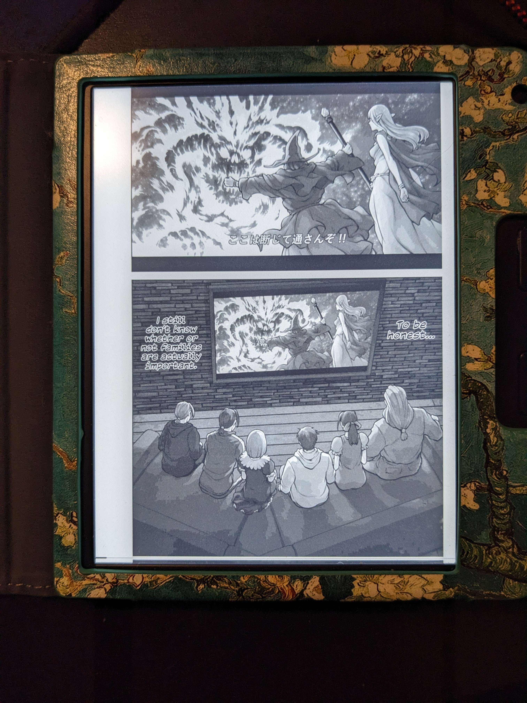

# manga-downloader-sync

Downloads images (manga) from the web into cbz files, converts to pdf,  and syncs between local cache and a device folder. Cache ensures files will not redownload.

<u>Only syncs newer chapters.</u> If older chapters are deleted from the device, only chapters after the latest chapter on device will be added. If no chapters exist on device, all chapters will be synced to device

## site support

- [mangadex](https://mangadex.org/)
- [danke.moe](https://danke.moe/)

## chapter number matching

Even if the feed changes, the chapter number is attempted to be extracted from the feed. This will not redownload cached chapter numbers even if the file name would be different.

### sources
`sources.txt` can support a flag to combine all chapters into a single file for those manga that like to be a page or two a chapter

> url, True

Or keeping as separate chapters..

> url

## device support

tested with `kobo libra 2` and will work with any device that supports pdf or cbz (zip) files





## features

### summary of download/sync

Summary will display both download and synced information. If device is absent, will inform. If only sync happens, will inform.

### author

Author is added to PDF metadata

## run

>  pip install -r requirements.txt       

Modify `sources.txt` run with python 3

> python program.py  

## sample sources

> Note: `mangadex` is looking for the GUID out of the url

```
https://danke.moe/read/manga/the-tsuntsuntsuntsuntsuntsuntsuntsuntsuntsuntsundere-girl/, True
https://danke.moe/read/manga/OL-cafe-crush/
https://mangadex.org/title/e5148679-29de-4fff-b1a1-c77c44c41d5a/crest-of-the-stars
```

## language

Hardcoded to `en` atm, and pretty much the first non-external source

## output
```
✓ kobo detected

The Tsuntsuntsuntsuntsuntsuntsuntsuntsuntsuntsundere Girl Getting Less and Less Tsun Day by Day - mangadex
    ✓ cache: 84       ✓ remote: 85          downloading: 84 to 85.0
100%|█████████████████████████████████████████████████████████████████████████████████████████████████| 2/2 [00:01<00:00,  1.20it/s]
  x device: 84      
The Overworked Office Lady's Café Crush - danke.moe
   ✓ cache: 3         ✓ remote: 3         ✓ device: 3      
~~~~~~~~~~~~~~~~~~~~~
Content missing from device, synced to device
The Tsuntsuntsuntsuntsuntsuntsuntsuntsuntsuntsundere Girl Getting Less and Less Tsun Day by Day - 85.pdf
```